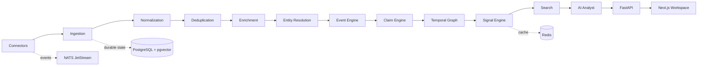

# PulseForge

> **Real-Time AI Event Intelligence Platform** — turn continuously changing information into an evidence-linked temporal knowledge graph so users can understand events, relationships, signals, and change over time.

PulseForge ingests live information, normalizes it into events, resolves entities, extracts evidence-linked claims, detects deterministic signals, and exposes the result through a temporal graph and an AI analyst that works over structured intelligence rather than raw documents.

## Why PulseForge

Most monitoring products stop at articles, search, or summaries. PulseForge treats articles as evidence about a changing world model. The core chain is explicit:

**sources → documents → entities → events → claims → temporal graph → signals → evidence-backed analysis**

Every important conclusion keeps provenance, and generated analysis is labeled as inference rather than fact.

## Signature experience: Temporal Graph Diff

Choose two points in time and PulseForge shows what entered, disappeared, strengthened, weakened, or became contradictory. The analyst can then explain the graph diff with evidence.

```text
2026-09-10 09:00 UTC                2026-09-11 09:00 UTC
────────────────────                ────────────────────
NVIDIA ── supplies ── CloudCo       NVIDIA ── supplies ── CloudCo
                                     ├── partners ── ModelLab     +
Open model ecosystem                Open model ecosystem ↑ 3.8×
                                     Product X launch date ⚠ conflict
```

## Demo

The repository ships a deterministic **AI Industry Intelligence** workspace with:

- normalized event clusters spanning chips, cloud, models, research, and open-source AI;
- a velocity spike for NVIDIA;
- an emerging inference-efficiency topic;
- a new NVIDIA ↔ Nebula Cloud relationship;
- a launch-date contradiction with competing evidence;
- entity dossiers, a timeline, signal center, evidence explorer, map, and generated briefing;
- a mock/local analyst mode that requires no paid API key.

After startup, open `http://localhost:3000/app`.

## Quick start

```bash
git clone https://github.com/PSR94/PulseForge.git
cd PulseForge
cp .env.example .env
docker compose up --build
```

Without Docker, run the API and web app separately:

```bash
python -m venv .venv
source .venv/bin/activate
pip install -e '.[dev]'
uvicorn pulseforge.main:app --reload --app-dir apps/api

cd apps/web
npm install
npm run dev
```

## Architecture



PulseForge deliberately keeps the vertical slice modular. The demo repository is in-memory and deterministic, while interfaces and infrastructure are arranged so PostgreSQL/pgvector, Redis, and JetStream can replace local adapters without changing domain rules.

See [`docs/architecture/overview.md`](docs/architecture/overview.md) and [`docs/architecture/evidence-model.md`](docs/architecture/evidence-model.md).

## Processing flow

Documents persist a processing stage and failure record rather than disappearing silently:

`INGESTED → NORMALIZED → DEDUPLICATED → ENRICHED → ENTITY_LINKED → EVENT_CLUSTERED → CLAIM_EXTRACTED → GRAPH_UPDATED → SIGNAL_ANALYZED → INDEXED`

The first production slice focuses on RSS/Atom ingestion, explainable clustering, entity resolution, temporal relationships, deterministic signal detection, evidence inspection, analyst explanations, and graph diff.

## Product surfaces

| Surface | Purpose |
| --- | --- |
| Live feed | Normalized events, source counts, confidence, novelty, impact, entities, and evidence |
| Event investigation | Claims, evidence, related events, source excerpts, and provenance |
| Entity dossier | Activity velocity, timeline, relationships, claims, contradictions, and sources |
| Temporal graph | Time-valid entities and relationships |
| Temporal Graph Diff | Added/removed/changed relationships, emerging entities, contradictions, acceleration |
| Signal center | Velocity, emergence, divergence, escalation, unusual activity, convergence |
| Analyst | Tool-driven answers grounded in structured state |
| Briefings | Evidence-linked Markdown/HTML/PDF-ready intelligence reports |

## AI architecture

The analyst is provider-neutral. Business logic never depends on a model deciding whether an event happened, two sources corroborate, or a threshold crossed. Models may extract or explain; deterministic state establishes those conclusions.

Available analyst tools in the initial slice:

`search_events`, `search_entities`, `query_graph`, `compare_time_ranges`, `find_claims`, `find_conflicts`, `calculate_velocity`, `find_related_events`, `inspect_sources`, `build_timeline`.

The default `mock` provider produces deterministic answers from these tools. OpenAI/Azure/local providers can implement the same interface.

## Evidence model

PulseForge separates:

- **Fact** — directly represented by stored source metadata or a deterministic system observation.
- **Claim** — an assertion extracted from a source and linked to evidence.
- **Evidence** — source excerpt + timestamps + canonical source metadata.
- **Inference** — an explanation derived from stored events/claims/signals.
- **Prediction** — a forward-looking statement, explicitly labeled and never promoted to fact.

An insight can always be traversed back to claims, events, excerpts, and source URLs.

## Security

The initial slice includes bounded URL ingestion, scheme validation, private-network SSRF blocking, content-type checks, workspace identifiers on domain objects, rate-limit hooks, sanitized logging patterns, environment-only secrets, and no browser-exposed provider API keys. See [`SECURITY.md`](SECURITY.md).

## Development

```bash
make install
make lint
make test
make web-test
```

Capture real README screenshots from a running application with:

```bash
make screenshots
```

The capture script writes actual Playwright screenshots into `docs/assets/`; generated mockups are intentionally not used as product screenshots.

## Repository map

```text
apps/api/       FastAPI domain, services, connectors, tests
apps/web/       Next.js intelligence workspace
examples/       connector and API examples
docs/           architecture and product notes
scripts/        deterministic screenshot capture
.github/        CI, security and container checks
```

## Roadmap

1. Harden the shipped vertical slice against larger real RSS workloads.
2. Add durable PostgreSQL repositories and pgvector indexing behind current interfaces.
3. Expand connectors to GitHub, arXiv, Hacker News, JSON feeds, uploads, and public APIs.
4. Add scheduled watchlists and explainable alert delivery.
5. Add pluggable Neo4j for deployments that outgrow the PostgreSQL temporal graph representation.
6. Add OpenSearch only when workload characteristics justify it.

See [`CHANGELOG.md`](CHANGELOG.md) for shipped milestones.

## License

Apache-2.0. See [`LICENSE`](LICENSE).
