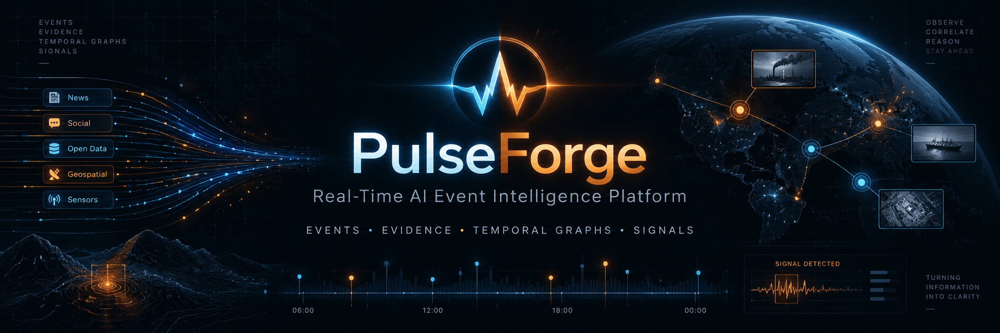
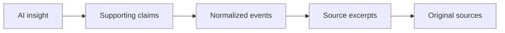
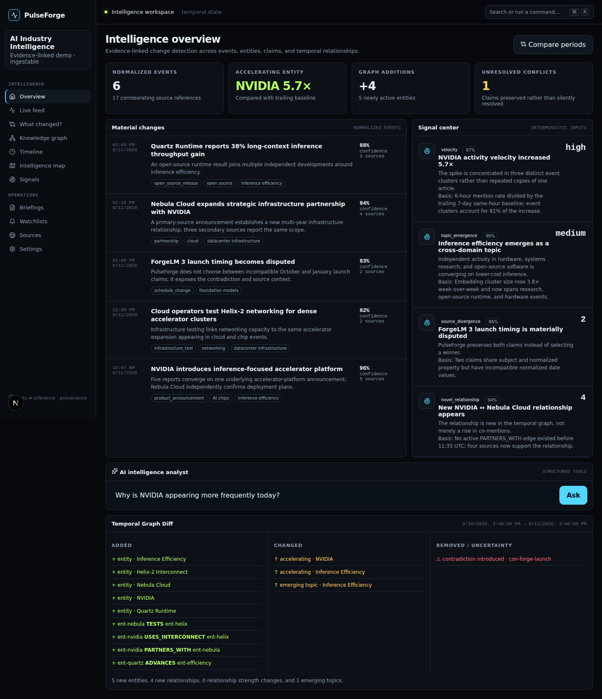
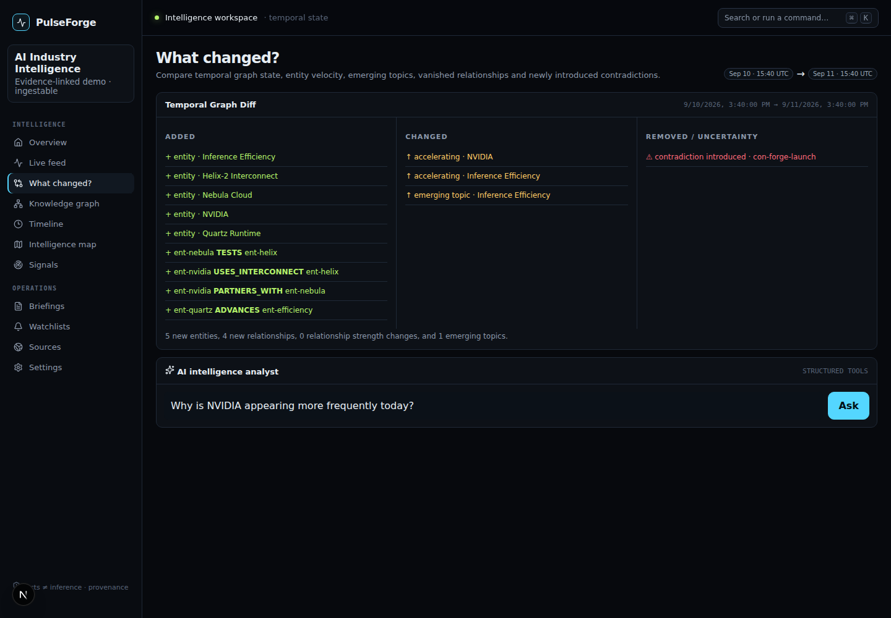
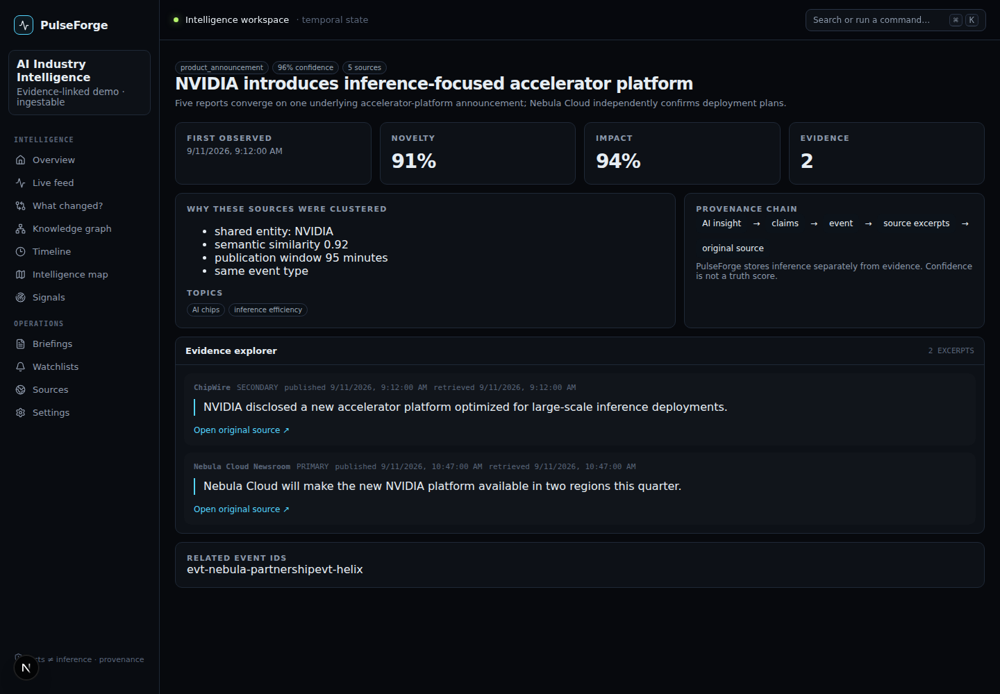
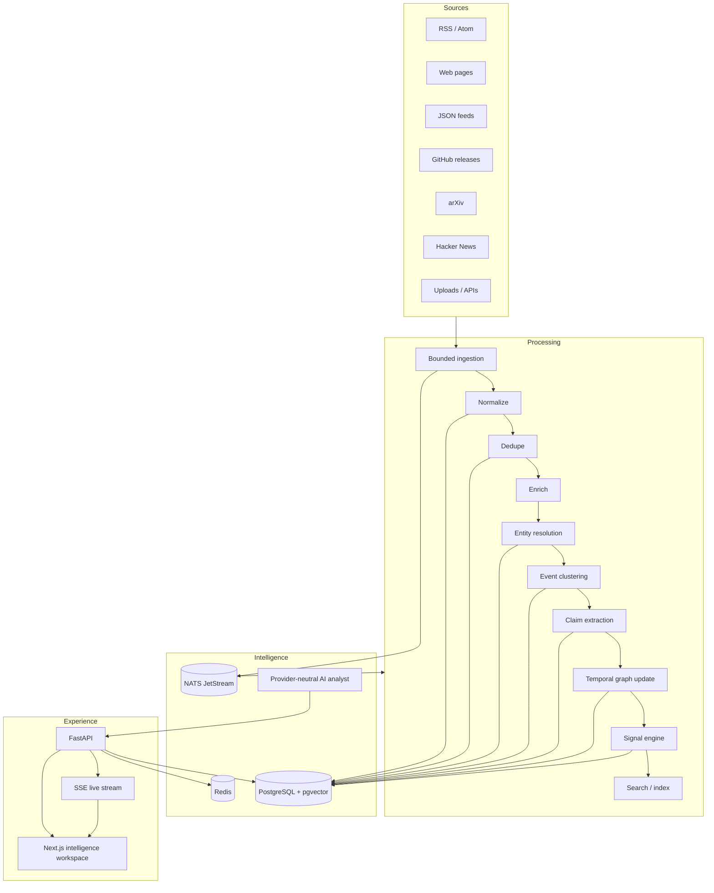
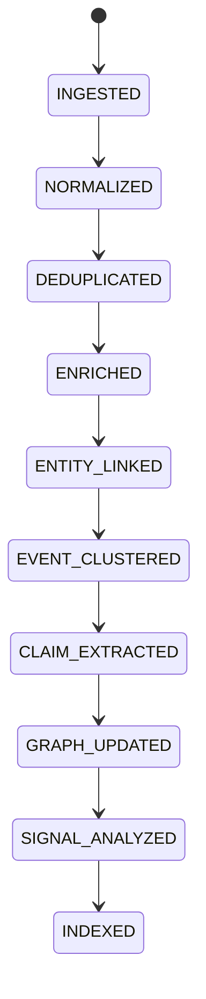
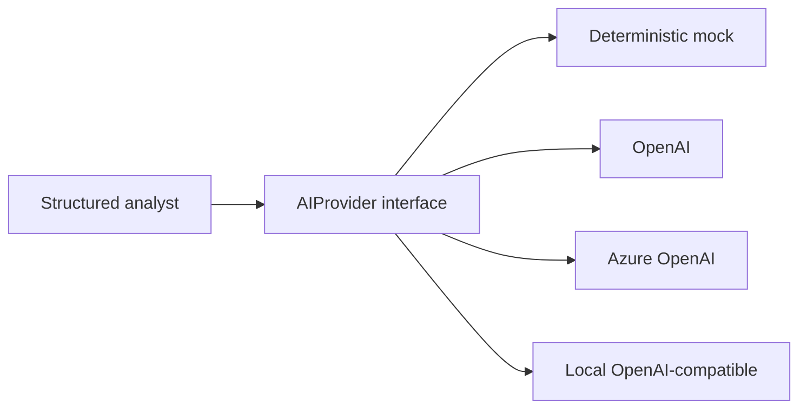
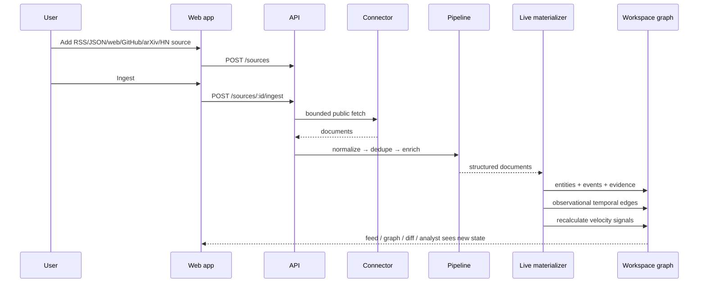

# PulseForge

<p align="center">
  
</p>

<p align="center">
  <strong>Real-Time AI Event Intelligence Platform</strong><br/>
  Turn continuously changing information into an evidence-linked temporal knowledge graph so users can understand events, relationships, signals, and change over time.
</p>

<p align="center">
  <a href="#quick-start">Quick start</a> ·
  <a href="#architecture">Architecture</a> ·
  <a href="#evidence-model">Evidence model</a> ·
  <a href="#temporal-graph-diff">Temporal Graph Diff</a> ·
  <a href="#demo-walkthrough">Demo</a> ·
  <a href="#security">Security</a>
</p>

---

## What PulseForge is

PulseForge continuously ingests information from RSS/Atom, JSON feeds, arbitrary public web pages,
GitHub releases, arXiv and Hacker News, then converts source documents into structured intelligence:

```text
sources
   ↓
documents / feeds
   ↓
normalization + deduplication
   ↓
entity resolution
   ↓
normalized event clusters
   ↓
claims + contradictions
   ↓
temporal knowledge graph
   ↓
signals / anomalies / trends
   ↓
AI synthesis over structured tools
   ↓
interactive intelligence workspace
```

It is deliberately **not** a generic chatbot or “RAG dashboard.” Articles are evidence about the world,
not the world model itself. Multiple documents can converge into one normalized event, relationships
have validity windows, signals are calculated from stored state, and every important conclusion exposes
provenance.

### Product principle

PulseForge separates:

**facts / observations → claims → evidence → inference → prediction**

A model-generated explanation never becomes an established fact merely because the model said it.



## Product screenshots

The screenshots below are captured by Playwright from the real application, not mockups. The repository
workflow regenerates them from the deterministic demo.

### Intelligence overview



### Temporal Graph Diff



### Evidence explorer



> If you are viewing a commit before the screenshot workflow has run, execute
> `make screenshots` after installing the web dependencies. The capture test writes these exact paths.

## Signature feature: Temporal Graph Diff

Choose two points in time and PulseForge compares the graph state:

```text
August 1                               September 1
────────────────────                   ──────────────────────────
Company A ─ SUPPLIES ─ Cloud B         Company A ─ SUPPLIES ─ Cloud B
                                       Company A ─ PARTNERS_WITH ─ Lab C   +
Topic: inference                       Topic: inference efficiency          ↑
Product launch: October                Product launch: October / January     ⚠
```

The diff exposes:

- `+` newly active entities
- `+` new temporal relationships
- `~` relationship strength changes
- `-` relationships no longer active
- `⚠` contradictions introduced
- `↑` accelerating entities and emerging topics
- `↓` declining entities

The analyst can then answer **“Explain what changed”** using the diff plus evidence IDs. The explanation
is labeled as inference and cites the stored state it used.

## Architecture



### Processing state machine

Every document carries explicit stage, retry count and last error state.



Long-running semantic work is designed for JetStream workers. Failed documents remain persisted and
retryable; they are never silently dropped.

### Repository layout

```text
PulseForge/
├── apps/
│   ├── api/
│   │   ├── migrations/                 # Alembic schema evolution
│   │   ├── pulseforge/
│   │   │   ├── ai/                     # OpenAI / Azure / local / mock adapters
│   │   │   ├── api/routes/             # Decomposed FastAPI endpoints
│   │   │   ├── connectors/             # Source adapters + registry
│   │   │   ├── domain/                 # Core models and contracts
│   │   │   ├── ingestion/              # Normalize / dedupe / enrich pipeline
│   │   │   ├── observability/          # Metrics, tracing, structured logging
│   │   │   ├── persistence/            # SQLAlchemy schemas/repositories
│   │   │   ├── security/               # Auth, workspace roles, rate limits
│   │   │   ├── services/               # Events, graph diff, signals, evidence
│   │   │   └── workers/                # JetStream consumers
│   │   └── tests/
│   └── web/
│       ├── app/                         # Next.js App Router screens
│       ├── components/                  # Intelligence UI primitives
│       ├── e2e/                         # Playwright product journeys
│       ├── lib/                         # API client + typed contracts
│       └── tests/                       # Vitest / accessibility-oriented tests
├── docs/
│   ├── adr/
│   ├── architecture/
│   ├── operations/
│   └── images/
├── infra/                               # Prometheus / OTel configs
├── scripts/                             # repo doctor / demo helpers
├── examples/
├── docker-compose.yml
├── alembic.ini
├── Makefile
└── pyproject.toml
```

## Evidence model

A stored claim means **“a source asserted this”**, not **“this is true.”**

Each evidence reference records:

- source ID and source name
- document ID
- canonical original URL
- publication time
- retrieval time
- extracted passage
- whether the source is primary

Contradictions are first-class objects. If one source says “October 2026” and another says
“January 2027,” PulseForge stores both claims and creates a contradiction object. It does not silently
choose the newer source or the source with a higher reputation.

Source reliability is similarly decomposed into observable properties—primary/secondary status,
publication history, direct quotations, independent confirmations and contradiction count—rather than
an opaque “truth score.”

## Temporal knowledge graph

Relationships are validity-bounded:

```yaml
source_entity_id: ent-nvidia
relationship_type: PARTNERS_WITH
target_entity_id: ent-nebula
valid_from: 2026-09-11T11:35:00Z
valid_to: null
source_count: 4
confidence: 0.91
strength: 0.91
evidence_ids:
  - ev-partner
```

The graph can therefore answer **what was believed active at a specific time**, not merely what is active
now.

Live deterministic ingestion uses an explicitly observational `CO_OCCURS_WITH` edge for co-mentions.
PulseForge never upgrades a co-mention into a factual business relationship by implication.

## Signal engine

Signal triggers come from deterministic state wherever possible.

Implemented signal families include:

- mention velocity
- novel relationship
- source divergence
- topic emergence
- event escalation
- unusual activity
- cross-domain convergence

Example:

```text
NVIDIA activity spike
current window: 31 appearances
baseline rate: 5.4 appearances / equivalent window
multiplier: 5.7×
threshold: 4×
primary drivers: 3 event clusters
```

An LLM may explain that signal. It does **not** decide whether 5.7× crossed 4×.

## AI analyst

The analyst operates over structured tools rather than dumping raw documents into one prompt.

Tool surface:

```text
search_events
search_entities
query_graph
compare_time_ranges
find_claims
find_conflicts
calculate_velocity
find_related_events
inspect_sources
build_timeline
```

Provider boundary:



Default local mode uses the deterministic mock provider and requires no paid credentials.

## Live ingestion end to end

Adding a public source from the UI now changes the workspace itself:



## Main screens

| Route | Purpose |
|---|---|
| `/` | product landing page |
| `/app` | intelligence overview |
| `/app/feed` | normalized live intelligence stream |
| `/app/events/[id]` | event investigation + evidence explorer |
| `/app/entities/[id]` | living entity dossier |
| `/app/compare` | signature “What changed?” experience |
| `/app/graph` | temporal knowledge graph |
| `/app/timeline` | temporal intelligence |
| `/app/map` | geospatial intelligence |
| `/app/signals` | deterministic signal center |
| `/app/briefings` | Markdown / HTML / PDF intelligence reports |
| `/app/watchlists` | monitoring rules + explainable alerts |
| `/app/sources` | connector and ingestion management |
| `/app/settings` | runtime/workspace capabilities |

Press **⌘K / Ctrl+K** anywhere in the workspace for unified search and commands.

## Quick start

Requirements:

- Docker + Docker Compose
- or Python 3.13 and Node 20+ for non-container development

```bash
git clone https://github.com/PSR94/PulseForge.git
cd PulseForge
cp .env.example .env
docker compose up --build
```

Then open:

- PulseForge: http://localhost:3000
- API docs: http://localhost:8000/docs
- API health: http://localhost:8000/health
- NATS monitor: http://localhost:8222

The default **AI Industry Intelligence** workspace is populated automatically and mock AI mode requires
no API key.

### Developer workflow

```bash
make install
make test
make lint
make e2e
```

Run only the backend:

```bash
uvicorn pulseforge.main:app --app-dir apps/api --reload
```

Run only the web app:

```bash
cd apps/web
npm install
npm run dev
```

Run database migrations:

```bash
make migrate
```

## Demo walkthrough

The deterministic demo contains:

- multiple source documents converged into event clusters
- one high-confidence NVIDIA velocity spike
- one emerging inference-efficiency topic
- one new cross-entity relationship
- one unresolved ForgeLM launch-date contradiction
- an evidence-linked 24-hour briefing
- a temporal graph diff with additions and acceleration

Follow `docs/demo-walkthrough.md` for the full product journey.

## Briefing export

Briefings expose three formats:

```text
GET /api/v1/briefings/{id}/markdown
GET /api/v1/briefings/{id}/html
GET /api/v1/briefings/{id}/pdf
```

All three are generated from the same evidence-linked briefing object.

## Observability

Structured logs include request IDs and avoid source bodies/secrets.

Prometheus metrics cover:

- documents processed
- processing failures
- LLM latency / estimated cost dimensions
- event clusters
- entity-resolution confidence
- signal generation
- ingestion delay
- active SSE clients

Metrics endpoint: `/api/v1/metrics`.

Set `PULSEFORGE_OTLP_ENDPOINT` to export traces through OpenTelemetry.

## Security

PulseForge includes:

- authentication modes for local development and JWT production deployments
- workspace-role primitives
- SSRF protection with redirect re-validation
- bounded downloads
- content-type allow lists
- rate limiting
- request IDs
- sanitized structured logging
- security response headers
- server-side AI credentials only
- audit-log schema for sensitive changes

Before deploying publicly, set a strong `PULSEFORGE_JWT_SECRET`, disable local auth, use a managed secret
store, restrict outbound network egress, terminate TLS at an ingress, and apply body-size limits.

See `SECURITY.md` and `docs/architecture/security.md`.

## Testing

Backend coverage includes:

- ingestion stage transitions
- SSRF validation
- RSS parsing
- deterministic enrichment
- entity resolution
- event clustering
- live materialization
- contradiction detection
- graph diff
- signal detection
- watchlist evaluation
- briefing export
- authentication
- API integration

Frontend coverage includes:

- component tests
- deterministic demo integrity
- Playwright critical product journey
- Playwright screenshot capture

CI also runs Ruff, Python tests, TypeScript checks, Vitest, Next production build, Playwright and container
builds. CodeQL and dependency updates are configured separately.

## Deployment

For durable production mode:

```env
PULSEFORGE_DEMO_MODE=false
PULSEFORGE_REPOSITORY_MODE=database
PULSEFORGE_AUTH_MODE=jwt
PULSEFORGE_JWT_SECRET=<secret-manager-value>
PULSEFORGE_AI_PROVIDER=openai
```

See `docs/operations/deployment.md` for the recommended API/worker/Postgres/Redis/NATS/OTel topology.

## Design decisions

Architecture decisions are documented in `docs/adr/`:

- PostgreSQL-first temporal graph
- NATS JetStream for local-first durable streaming
- evidence-first AI boundary

## Roadmap

The vertical slice is intentionally deep before connector breadth grows further. Near-term work:

- durable semantic worker writes for every stage in database mode
- pgvector candidate retrieval for high-volume event clustering
- optional OpenSearch adapter
- webhook connector framework
- richer geocoding and region aggregation
- multi-user SSO/OIDC adapter
- distributed Redis rate limiter
- alert delivery adapters (email, webhook, Slack)
- advanced source trust policies
- optional Neo4j projection for deep graph workloads

## Contributing

See `CONTRIBUTING.md`. Architecture changes that alter evidence semantics, signal determinism or temporal
relationship meaning should include an ADR.

## License

Apache-2.0. See `LICENSE`.
