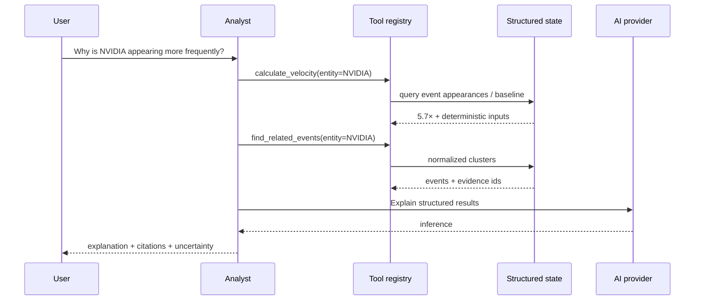

# AI analyst architecture

The analyst operates over structured intelligence rather than an unbounded document prompt.

Provider adapters:
- deterministic mock
- OpenAI Responses structured output
- Azure OpenAI structured chat completion
- local OpenAI-compatible endpoints

Business logic does not depend on a single provider.
