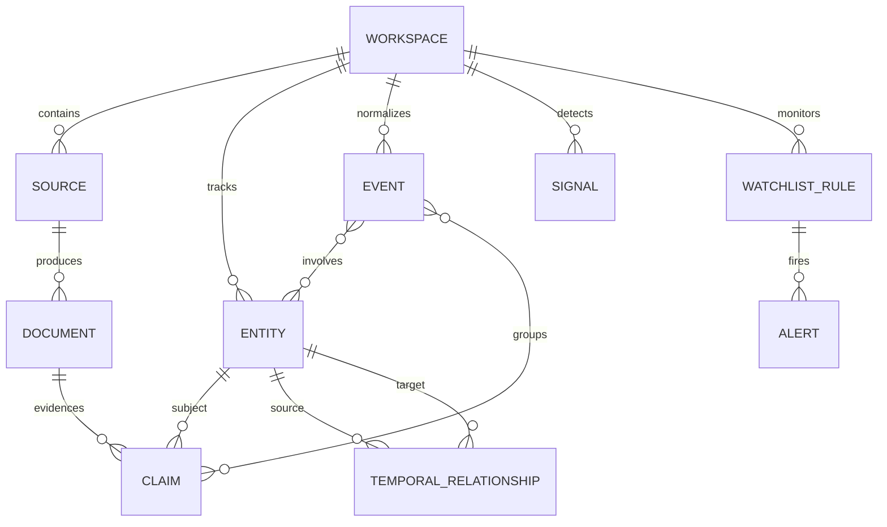

# Data model

PostgreSQL is the canonical durable store. pgvector is the scale-up path for semantic search and event
candidate retrieval; exact/deterministic filters remain ordinary SQL so graph and signal decisions can
be inspected.
