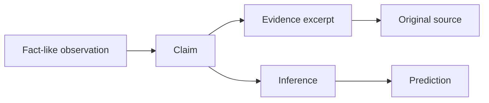

# Evidence and epistemic model

PulseForge keeps five concepts separate:

A **claim** is something a source states. Storing a claim does not make it true. An **evidence reference**
records the source, document, excerpt, publication time, retrieval time and canonical URL that supports
inspection of that claim.

A **contradiction** exists when two stored claims have the same normalized subject/property but
incompatible normalized values. PulseForge preserves both and exposes source recency and observable
reliability dimensions rather than silently selecting a winner.

AI answers use the labels `fact`, `inference`, or `prediction`. The local analyst defaults to
`inference` and returns citations to event, signal, claim, evidence or relationship IDs.

Source reliability is not collapsed into a single truth score. The data model tracks observable
properties such as primary/secondary status, publication history, independent confirmations, direct
quotations and contradiction count.
