# PulseForge architecture

PulseForge is organized around one rule: **model output is not system truth**.

The source of record is the combination of normalized documents, extracted claims, explicit evidence,
temporal relationships, deterministic signal inputs, and versioned processing state. AI providers are
adapters that extract or explain structured state; they do not decide whether a source threshold fired.

```mermaid
flowchart LR
    C[Connectors] --> I[Ingestion]
    I --> N[Normalize / Dedupe]
    N --> E[Enrichment]
    E --> ER[Entity resolution]
    ER --> EV[Event engine]
    EV --> CL[Claim engine]
    CL --> TG[Temporal graph]
    TG --> SG[Signal engine]
    SG --> IX[Search / Index]
    IX --> AA[AI analyst tools]
    AA --> API[FastAPI]
    API --> WEB[Next.js workspace]
```

## Runtime boundaries

- **API** owns request validation, workspace authorization, query APIs and SSE delivery.
- **Worker** consumes durable stage messages from NATS JetStream and advances long-running semantic work.
- **PostgreSQL + pgvector** is the durable intelligence store.
- **Redis** is reserved for distributed rate limiting, cache, locks and ephemeral coordination.
- **NATS JetStream** carries retryable processing work and event notifications.
- **Next.js** is a keyboard-first intelligence workspace, not the source of truth.
- **AI provider adapters** expose OpenAI, Azure OpenAI, local OpenAI-compatible and deterministic mock modes.

The default local configuration intentionally starts in deterministic demo mode so contributors can
explore the full product without API credentials.
