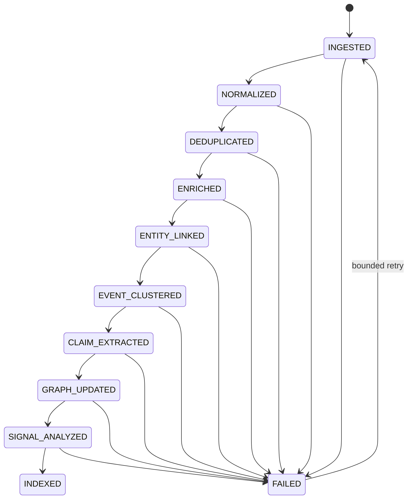

# Processing pipeline

Each source document carries its current processing stage. A failed document remains addressable and
retryable; the system does not silently discard work.

## Local deterministic materialization

The local/demo path is intentionally inspectable:

1. Connector performs bounded SSRF-safe fetch.
2. Content is normalized and content-hash deduplicated.
3. Deterministic enrichment records entity candidates.
4. `LiveMaterializer` resolves aliases against the current workspace and creates new entities only when
   no match exists.
5. Similar documents converge into one event using title-token similarity, shared entities and a
   72-hour temporal window.
6. Evidence excerpts are attached to the normalized event.
7. Co-occurrence edges are typed `CO_OCCURS_WITH` so they cannot be confused with factual relations.
8. Velocity is recalculated from stored event appearances. A signal fires only if the deterministic
   4× threshold and minimum current-event count are both satisfied.
9. Feed, graph, timeline, search and analyst tools immediately see the updated state.

Production semantic stages can replace deterministic enrichment with provider-backed extraction while
preserving the same persisted contracts and stage transitions.
