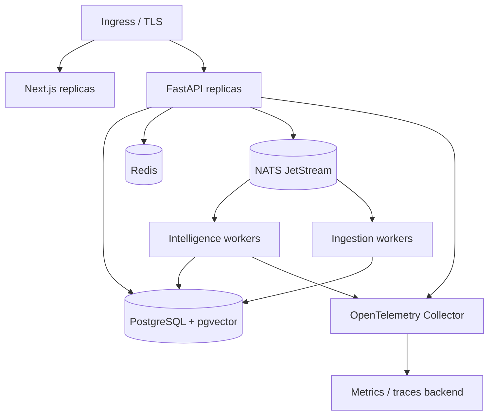

# Deployment

Production deployments should switch:

```env
PULSEFORGE_DEMO_MODE=false
PULSEFORGE_REPOSITORY_MODE=database
PULSEFORGE_AUTH_MODE=jwt
PULSEFORGE_JWT_SECRET=<secret-manager-value>
PULSEFORGE_AI_PROVIDER=openai|azure_openai|local
```

Recommended topology:



Run Alembic migrations before promoting API/worker replicas. Use managed Postgres backups, NATS stream
replication, a secret manager, outbound egress controls and a reverse proxy that enforces request/body
limits.
